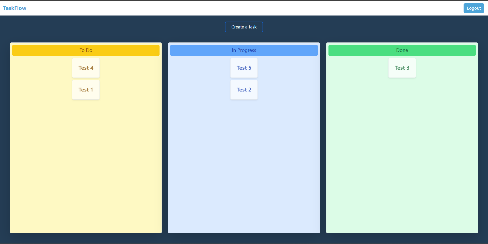

# TaskFlow - Fullstack Project with NestJS and React
### TaskFlow is a full-stack project built to learn NestJS by implementing an authentication system with JWT, 
### creating the backend using NestJS, and developing the frontend with React. 
### This document provides instructions on how to set up and run the project.

## Introduction

TaskFlow is a web application that allows users to manage tasks and workflows efficiently. 
It provides a user-friendly interface to create, organize, and track tasks while providing a smooth user experience.

## Features
- User Authentication with JWT
- Task Management
- Workflow Creation and Organization

## Prerequisites

Before you begin, make sure you have the following tools installed on your system:
Node.js (v18)
npm or yarn package manager
Docker (for running PostgreSQL container)

## Installation

Follow the steps below to set up the project:

### Backend

1. Ensure you have Docker installed on your machine.
2. Clone the repository:
  git clone https://github.com/Kurler3/task-flow.git
  cd task-flow
3. Install the required dependencies.
  cd backend
  yarn install
4. Start the PostgreSQL database container
   yarn db:dev:restart
5. Make sure to add the DATABASE_URI to the .env file.
6. Start the backend server:
   yarn dev

### Frontend

1. Make sure you have already cloned the repository and navigated into the project folder.
2. Navigate to the frontend directory:
   cd client
3. Install the required dependencies:
   yarn install
4. Start the development server:
   yarn start:dev
